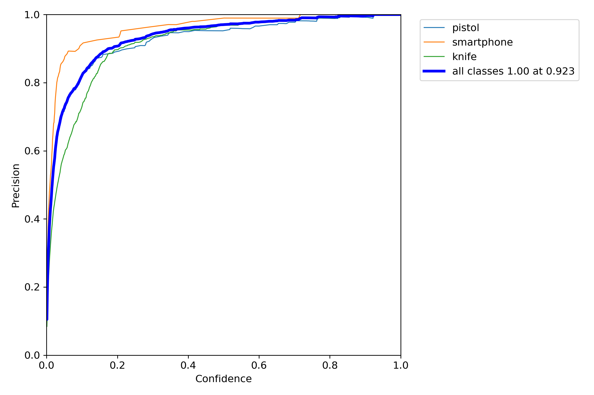
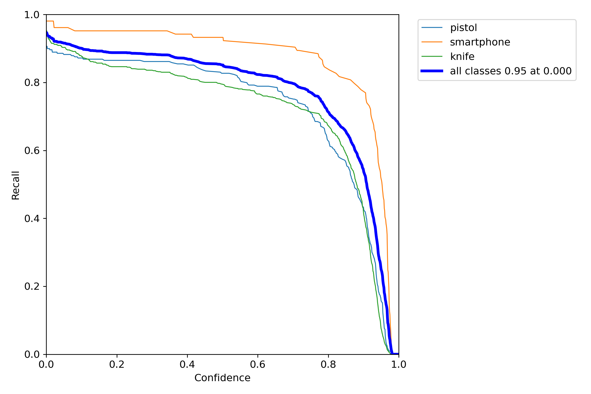
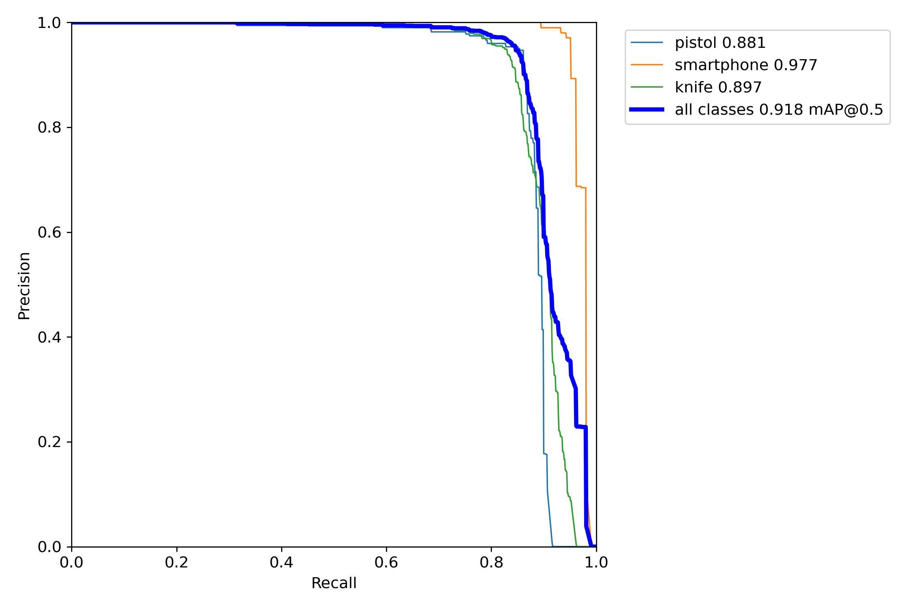
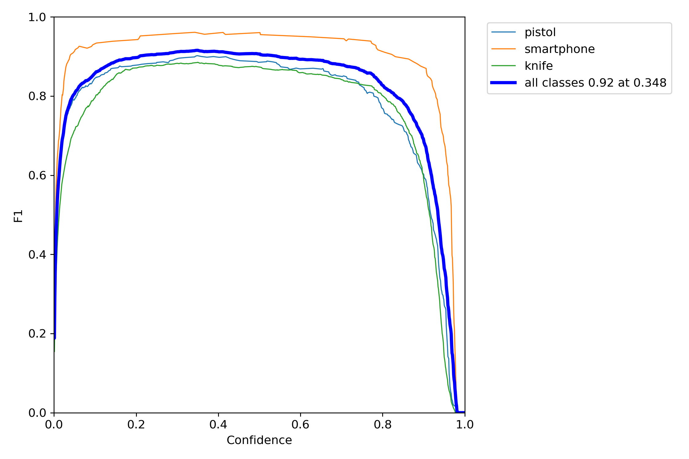
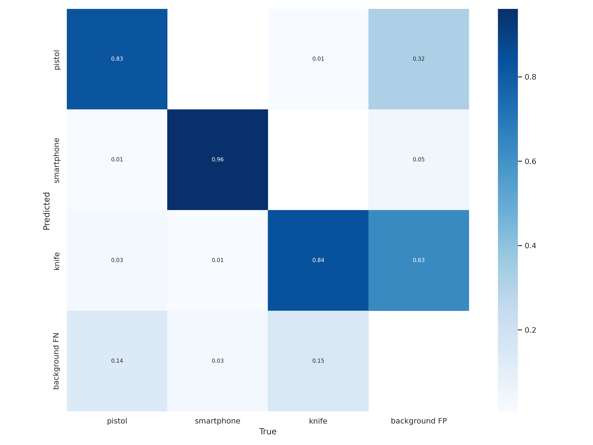

# EDABK_YOLOV7_TINY_WEAPON_DETECTION

_Project using yolov7 tiny achitecture to detect weapon that appear in video, which taken from university camera_

## I. Config

Sử dụng yolov7 với các tham số config: 

- batch size: 64
- pretrain weights: yolov7-tiny
- epochs: 100
- images size: 640

## II. Dataset

### 1. Dataset size lớn

Tập dataset từ nguồn [OD-WeaponDetection](https://github.com/ari-dasci/OD-WeaponDetection/tree/master/Weapons%20and%20similar%20handled%20objects/Sohas_weapon-Detection-YOLOv5)

Gồm data về pistol, knife và smartphone, trong đó:

Tập train:

type | number of images
-----|------------------
Pistol| 1425
Smart phone| 575
Knife |1825

Tập test:

type | number of images
-----|------------------
Pistol| 78
Smart phone| 104
Knife | 644

### 2. Dataset ghép vào video size nhỏ

Bộ dataset có 952 ảnh được lấy ra từ frame của video, mỗi ảnh được ghép random từ 1-4 vũ khí từ thư mục [weapon](./assets/img/) vào các vị trí random định sẵn trên các frame

Bộ dataset này được chia ra làm tập train chiếm 80% và test chiếm 20% dataset

## III Thực thi

Source code thực thi tại file [yolov7_tiny_weapon_detection](./yolov7_tiny_weapon_detection.ipynb)

Source code colab [tại đây](https://colab.research.google.com/drive/1UTgIPA_z2zvPGF0dXFxQzWR2NTUEGoCG?usp=sharing)
## III. Evaluating

Model training đạt ~92% mPA-0.5.

File runs [tại đây](https://drive.google.com/drive/folders/1qtj-AJ2U2x3vMyS7ZqhUEOBhWUnY46mZ?usp=sharing)

### Ảnh Precision curve

### Ảnh Recall curve

### Ảnh Recall và Precision curve

### Ảnh F1 curve

### Ảnh confusion matrix

## IV Các kết quả thu được trên video

Các file .avi trong [assets](./assets/video/)

[Video 1](./assets/video/pistol_video_4_result.avi)

[Video 2](./assets/video/test_with_weapon_result.avi)

[Video 3](./assets/video/knife_video_3_result.avi)